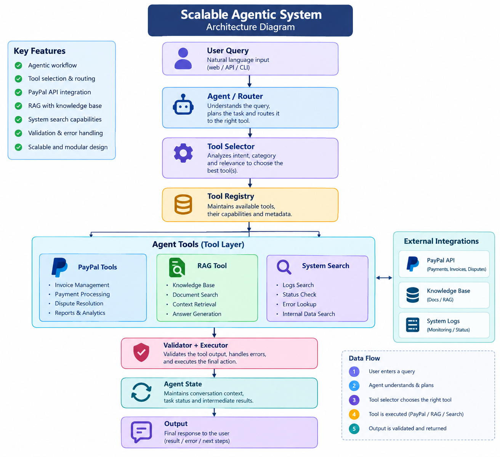

# Scalable Agentic System

A modular Python-based agentic system designed to intelligently route user requests, identify relevant tools, validate parameters, and execute the required APIs without exposing the entire tool ecosystem to the agent.

The prototype demonstrates how an agentic architecture can scale from a small set of tools to hundreds or thousands of APIs through structured routing, tool discovery, relevance-based selection, validation, state management, and controlled execution.

---

## 1. Overview

This project implements a scalable agentic system that can select and execute the correct tool from a growing set of APIs.

The prototype is designed around a PayPal-style API ecosystem containing tools for:

- Invoice management
- Payments
- Disputes
- Sales reports

The architecture also includes:

- RAG / Knowledge Base search
- System capability and status search
- Multi-step workflow execution
- Parameter validation
- Error handling
- Service/category filtering
- Top-K tool selection

The design can be extended from a small number of tools to hundreds or thousands of APIs without exposing all tools to the agent at the same time.

---

## 2. Architecture



The architecture follows a modular design where requests are routed, relevant tools are selected, parameters are validated, and the selected tools are executed while maintaining the required state.

---

## 3. Problem Statement

An agentic system may need to work with hundreds or thousands of APIs.

For example:

- Create an invoice
- Send a payment
- Check a dispute
- Get a sales report
- Search a knowledge base
- Search system capabilities

If every available tool is presented to the agent for every request, tool selection can become inefficient and inaccurate.

This project addresses this problem using:

- Query routing
- Service/category filtering
- Tool relevance scoring
- Top-K tool selection
- Parameter validation
- Controlled execution
- Error handling
- State management

The main objective is to reduce unnecessary tool exposure while ensuring that the agent can identify and execute the appropriate tool for each request.

---

## 4. Example User Requests

### Invoice

```text
Create an invoice for John for $50